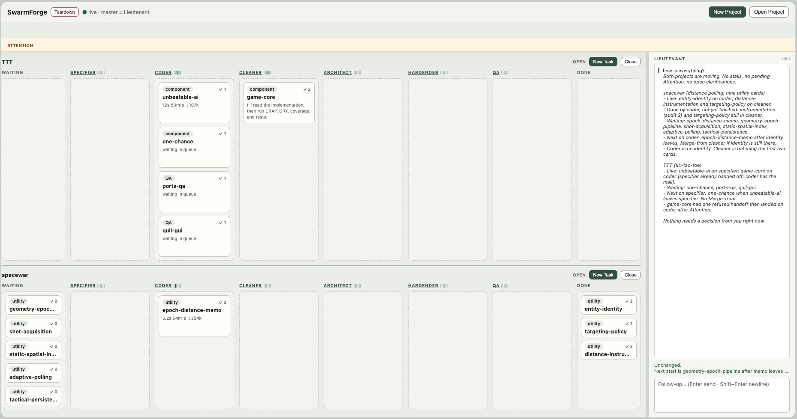

# SwarmForge Lieutenant

The `lieutenant` branch is a single-pipeline forge. One host lieutenant runs a
dashboard, plans work, and dispatches cards across any number of project swarms.
It is a forge installed around projects, not a pack installed inside one
existing project.

The repository's master branch is named
[`main`](https://github.com/unclebob/swarm-forge/tree/main). Read its
[README](https://github.com/unclebob/swarm-forge/blob/main/README.md) for the
SwarmForge overview, prerequisites, product comparison, and installation of
`get-swarm-forge`. This README covers only the structure and operation of the
lieutenant forge.



## Structure

An installed lieutenant forge has two levels:

| Level | Purpose | Configuration |
|---|---|---|
| Forge host | Runs the dashboard and one lieutenant agent. The lieutenant plans and dispatches; it does not implement project work. | `swarmforge/swarmforge.conf` |
| Project swarm | Runs the engineering agents for one directory under `projects/`. Every new project begins with this branch's project-pack. | Default: `.swarmforge/project-pack/swarmforge/swarmforge.conf`; active copy: `projects/<name>/swarmforge/swarmforge.conf` |

The relevant source and installed layout is:

```text
<forge>/
  swarm
  swarmforge/
    swarmforge.conf              # host lieutenant backend and arguments
    roles/
      lieutenant.prompt          # planner and dispatcher instructions
    scripts/                     # shared runtime and dashboard
    constitution/articles/       # shared articles copied into projects
  .swarmforge/
    project-pack/                # committed default project template
      swarmforge/
        swarmforge.conf          # card routes, agents, and worktrees
        constitution.prompt
        roles/
          specifier.prompt
          coder.prompt
          cleaner.prompt
          architect.prompt
          hardender.prompt
          QA.prompt
  projects/                      # generated projects; ignored by forge git
```

Most other files under `.swarmforge/` are generated host state. Inside a
project, `.swarmforge/` is runtime state and `.worktrees/` contains the role
worktrees; both are ignored by that project's git repository. The exception at
the forge level is `.swarmforge/project-pack/`, which is committed because it
is the template for new and reopened projects.

The runtime scripts, shared constitution articles, handoff machinery, tmux
behavior, and installer are common SwarmForge infrastructure. Their canonical
home and documentation are on [`main`](https://github.com/unclebob/swarm-forge/tree/main);
this branch carries the copies required for a standalone lieutenant install.

## Host and project configuration

The host configuration contains one `Lieutenant` line. In this branch it is:

```conf
Lieutenant codex
```

That line selects the host agent backend and any additional CLI arguments. The
host lieutenant runs in the forge root, has its own tmux session, and follows
`swarmforge/roles/lieutenant.prompt`. It is deliberately outside the project
engineering constitution.

The committed project template is
[`.swarmforge/project-pack/swarmforge/swarmforge.conf`](.swarmforge/project-pack/swarmforge/swarmforge.conf).
It is the authority for the default card routes, project agent backends,
worktree assignments, receive modes, and backward propagation.

Its two directive forms are:

```text
card <type> <first-role> [<next-role>...]
window[-invisible] <role> <backend> <worktree> [task|batch] [forward-only|back-one|back-all] [backend arguments...]
```

Each `card` line defines an ordered route. Each `window` line defines one role
that may appear in those routes. `master` selects the project checkout;
ordinary worktree names are created under `.worktrees/`. `window-invisible`
keeps the role in tmux without opening a separate terminal surface. Receive
mode defaults to `task`, propagation defaults to `forward-only`, and tokens
after those optional fields are passed to the selected agent backend.

### Default card routes

| Card type | Route | Intended use |
|---|---|---|
| `utility` | `coder` → `cleaner` → Done | A small implementation or maintenance task whose card text is the specification; no Gherkin or headed QA. |
| `component` | `specifier` → `coder` → `cleaner` → `architect` → `hardender` → Done | A behavior change with Gherkin specification and the engineering quality pipeline, but no headed QA suite. |
| `QA` | `specifier` → `coder` → `cleaner` → `architect` → `hardender` → `QA` → Done | A behavior change that also needs specified and executable end-to-end UI verification. |
| `review` | `cleaner` → `architect` → `hardender` → `QA` → Done | A brownfield review and hardening pass without inventing new behavior. QA runs an existing `qa/` suite or passes through if none exists. |

### Project roles

The project role prompts divide responsibility as follows:

- [`specifier`](.swarmforge/project-pack/swarmforge/roles/specifier.prompt)
  turns intent into Gherkin; on `QA` cards it also specifies the
  headed end-to-end QA procedures.
- [`coder`](.swarmforge/project-pack/swarmforge/roles/coder.prompt) implements
  behavior with TDD, unit tests, and generated acceptance
  tests where the card route requires them.
- [`cleaner`](.swarmforge/project-pack/swarmforge/roles/cleaner.prompt)
  performs local behavior-preserving cleanup and quality analysis.
- [`architect`](.swarmforge/project-pack/swarmforge/roles/architect.prompt)
  improves boundaries and dependency direction and owns property
  testing support.
- [`hardender`](.swarmforge/project-pack/swarmforge/roles/hardender.prompt)
  performs mutation hardening and the final non-headed quality
  gates.
- [`QA`](.swarmforge/project-pack/swarmforge/roles/QA.prompt) executes
  independent user-interface verification and makes narrow fixes
  for failures it finds.

### Default worktrees and queue modes

| Role | Working directory | Receive mode | Propagation |
|---|---|---|---|
| `specifier` | project root (`master`) | task | forward only |
| `coder` | `.worktrees/coder` | task | forward only |
| `cleaner` | `.worktrees/cleaner` | batch | back one |
| `architect` | `.worktrees/architect` | batch | back all |
| `hardender` | `.worktrees/hardender` | batch | forward only |
| `QA` | `.worktrees/QA` | batch | back all |

In a project configuration, `master` means the main project checkout on its
current branch. It does not require that git branch to be named `master` and is
unrelated to this repository's `main` branch.

New Project preloads the template configuration into an editable **Config**
field, so a project can change its routes, backends, or worktrees before it is
created. On a later **Open Project**, the forge refreshes that project's
managed scripts, shared articles, constitution entry point, and role prompts
from the current forge, but preserves the project's own
`swarmforge/swarmforge.conf`.

## Constitution and instruction assembly

The host lieutenant and project agents intentionally receive different
instructions:

- The host reads only
  [`swarmforge/roles/lieutenant.prompt`](swarmforge/roles/lieutenant.prompt).
  That prompt makes it a planning and dispatch agent and explicitly tells it
  not to follow the engineering constitution.
- A project agent first reads the project pack's
  [`constitution.prompt`](.swarmforge/project-pack/swarmforge/constitution.prompt),
  then every article under the project's `swarmforge/constitution/articles/`,
  and finally its matching role prompt. The entry point takes precedence over
  its articles; the role prompt specializes responsibility within that common
  law.

This branch carries the three shared articles copied from `main`:

| Article | Applies to project agents |
|---|---|
| [`engineering.prompt`](swarmforge/constitution/articles/engineering.prompt) | Tool selection, TDD and acceptance infrastructure, testability, mutation, CRAP, DRY, and verification guardrails. |
| [`workflow.prompt`](swarmforge/constitution/articles/workflow.prompt) | Worktree boundaries, commit bylines, scratch paths, and startup failure behavior. |
| [`handoffs.prompt`](swarmforge/constitution/articles/handoffs.prompt) | Structured handoff creation, acceptance, merge direction, batching, and completion. |

The lieutenant project pack adds no local constitution article. Its
specialization is the typed configuration and the six role prompts. Canonical
documentation for the shared articles and handoff machinery remains on
[`main`](https://github.com/unclebob/swarm-forge/tree/main).

## Install and start

After installing `get-swarm-forge` as described on `main`, run this in the
empty directory that will contain the forge:

```sh
get-swarm-forge lieutenant
./swarm
```

`get-swarm-forge lieutenant` installs the host, the project-pack, and an empty
`projects/` directory. `./swarm` starts only the dashboard and host lieutenant;
project agents start when a project is created or opened. Startup prints the
local dashboard URL and normally opens it in a browser.

Set `SWARMFORGE_OPEN_BROWSER=0` to leave the browser closed. Set
`SWARMFORGE_PREVENT_SLEEP=0` to disable the host sleep inhibitor.

## Project lifecycle

### Create a project

**New Project** accepts a name, mission, and project configuration. It can
either create an empty project or clone a GitHub `owner/repo`. Creation happens
in a staging directory; the forge overlays its shared runtime and project-pack,
writes `mission.md`, establishes the runtime ignore rules, commits a clean
managed baseline, moves the result to `projects/<name>/`, and starts its swarm.

If `projects/<name>/` already exists, the dashboard asks before replacing it.
Replacement permanently clears that directory and keeps no backup.

### Open, close, and refresh

**Open Project** starts an existing directory under `projects/`. Before
startup, it refreshes the managed SwarmForge tree from the host and project-pack
and commits any resulting managed changes. Product files, `mission.md`, and the
project's configuration are preserved.

**Close** stops that project's agent sessions and handoff daemon but leaves the
project directory in place. Several projects may be open at once. The dashboard
aggregates their boards, work queues, approvals, clarifications, failures, and
agent status.

**Teardown** closes every open project and then stops the host lieutenant,
dashboard, and tmux sessions. Project directories remain on disk. After the
next `./swarm`, projects remain stopped until they are opened again.

## Work lifecycle

1. The lieutenant reads a new project's `mission.md`, watches its live board,
   proposes cards with types and dependencies, and asks the operator to approve
   the plan. It never edits the product itself.
2. **New Task** defaults to `LT`. An `LT` task sends a directive to the
   lieutenant without creating a card. Selecting `utility`, `component`, `QA`,
   or `review` creates a waiting card of that type and notifies the lieutenant.
3. The lieutenant starts an approved waiting card by moving it into the first
   lane of its configured route. It may run independent cards in parallel when
   their starting lanes are free.
4. Each role accepts its work, merges the committed handoff, performs its owned
   part of the job, commits, and hands the card to the next role. The handoff
   daemon moves the board card when delivery succeeds. Batch roles may accept
   compatible queued cards together. A received batch is one atomic work unit:
   its manifest identifies the one ancestry-complete commit to merge, and the
   role must finish every member in one combined outgoing handoff.
5. Because `specifier` uses the project root, its forward handoff on
   `component` and `QA` routes is held in **Attention** for operator approval
   before delivery to `coder`. Clarification requests and repeated delivery
   failures also appear in Attention.
6. The last role sends the route's terminal handoff to every configured role
   before it in window order. After that complete delivery, the board moves the
   card to **Done**.

### Pause, daemon restart, levels, and links

Each project band has a **Pause** button; `./swarm drain projects/<name>` does
the same from a shell. Roles finish their current turn, `ready_for_next.sh`
prints `PAUSED` instead of taking new mail (notes between roles still arrive),
and the project's handoff daemon keeps every git handoff in its outbox, so no
card changes lane. Handoffs that need approval still go to Attention. A card
the lieutenant starts from Waiting gets its start note, but the role does not
take it until Resume. Retry is refused while paused. The band shows a PAUSED banner with what is
still finishing and how many handoffs are held. `./swarm status
projects/<name>` reports `DRAINED: yes` once no role has in-process work and
prints `HELD:` (paused) or `QUEUED:` for outbox handoffs. **Resume** or `./swarm
resume projects/<name>` delivers the held handoffs (each inbox takes them in
priority order) and wakes roles that have mail. While paused, a held card can
still change level or priority, or leave the queue.

If a project's handoff daemon stops, no handoff is delivered and its band shows
a HANDOFFS STOPPED banner. Its **Restart daemon** button, or `./swarm daemon
projects/<name>`, starts it again. The daemon also stops by itself when its pid
file is gone or names another daemon, so a deleted or restarted project never
keeps two daemons delivering the same mail. After updating SwarmForge scripts
in a running project, restart its daemon so the one that holds handoffs during
a pause is the new one.

New Task gives a typed card a level: Critical, High, Normal or Low. The level
sets the priority of the card's handoffs at every role (10, 30, 50, 70; lower
runs first), starting with the note that starts it from Waiting, whenever the
agent leaves the default 50 or no priority. A priority the role chose on
purpose, such as a `00` follow-up, still wins, merge-only copies keep their
priority, and cards without a level keep the priority the agent typed. A
batch takes the level of its most urgent card. **Change level…** in the card
menu sets a new level and reorders the card's waiting mail; a batch that also
carries other cards keeps its priority. Because batch roles take only mail of
one priority (and card type) per batch, cards of different levels are batched
separately, and Low cards wait while higher-level work keeps arriving. Levels
are kept in `.swarmforge/board/meta/<task-id>.edn`.

**Links…** in the card menu (or the New Task dialog) records which cards block
a card and which are related. Links are kept by task id, so renames keep them.
A self link or a cycle is refused. A card with an unfinished blocker stays in
Waiting: the lieutenant's start of it is refused until every blocker is done
or the operator removes the link. Blockers never hold mail that is already in
the pipeline, and a deleted blocker no longer holds a card.

Cards also show why they are not moving: Handing off, Handoff held until
Resume, Delivery failed (with the error from `handoffs/failed/`), or No mail
when nothing will pick the card up (drawn red). A card a later role sent back
with `return: true` shows who returned it and how many times it was returned.
Questions in Attention keep their line breaks, can be expanded, and take a
multi-line answer (Enter adds a line, Ctrl/Cmd+Enter sends); **Open** shows the
question and answer in a larger in-page dialog.

The chat rail talks only to the host lieutenant. Agent names in **Work Queue**
open live captures of project-agent panes; the agents themselves continue to
run in tmux.

For the durable handoff format, audit gate, delivery states, retries, and merge
rules, see the
[`main` handoff protocol](https://github.com/unclebob/swarm-forge/blob/main/swarmforge/handoff-protocol.md).

## Runtime components and generated state

| Component | Responsibility |
|---|---|
| `forge.*` | Stages creation, overlays the project pack, refreshes managed files on open, and starts or stops project swarms. |
| `swarmforge.*` and `card_type.*` | Parse host/project configuration, create sessions and worktrees, and resolve typed card routes. |
| `handoffd.*` and the handoff helpers | Deliver, audit, merge, and complete committed work between roles. |
| `pack_board*` and `pack_web*` | Maintain the boards and expose the dashboard, chat, Attention queue, pane captures, and controls. |
| Terminal adapters, watchdog, and cleanup scripts | Open requested surfaces, monitor agents, and shut down projects or the forge. |

The forge root's `.swarmforge/` holds host sessions, open-project records, and
dashboard process state. Each `projects/<name>/.swarmforge/` holds that
project's role/session maps, board, handoff queues, approvals, clarifications,
and daemon state; `projects/<name>/.worktrees/` holds generated role checkouts.
Those directories are runtime records. Product artifacts and durable source
history remain in the project directory and git repository.

## Changing the lieutenant branch

- Change `swarmforge/swarmforge.conf` or
  `swarmforge/roles/lieutenant.prompt` to change the host lieutenant.
- Change `.swarmforge/project-pack/swarmforge/swarmforge.conf` and its `roles/`
  prompts to change the default project pipeline.
- Put common runtime, installer, terminal, dashboard, or shared constitution
  changes on `main` first, then carry the required copies into this branch.
- Treat the two configuration files as the source of truth. This README should
  explain their structure and intent, not replace them.
